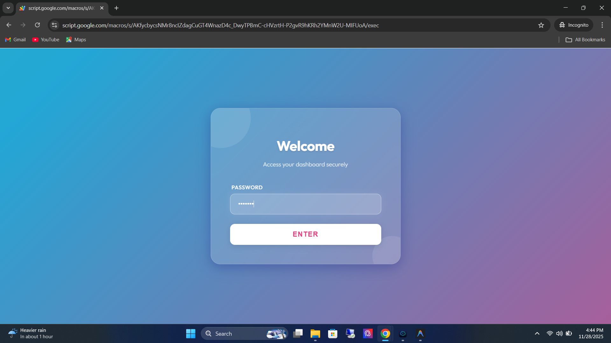
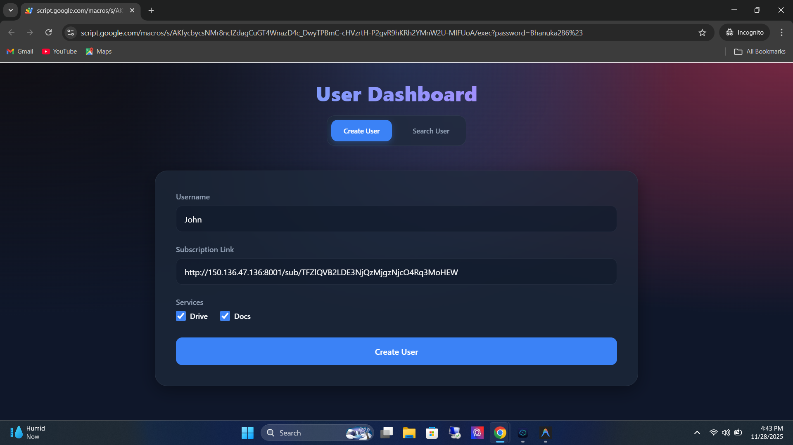
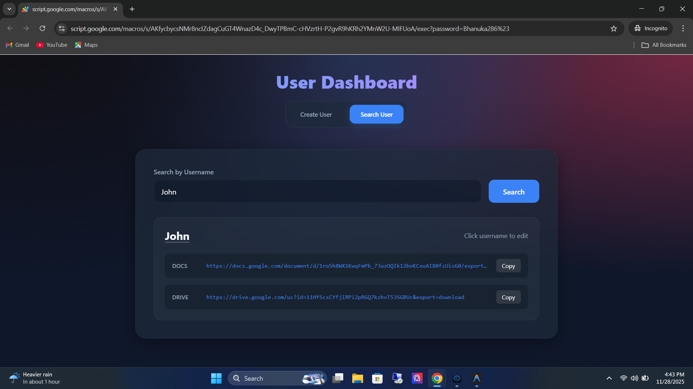
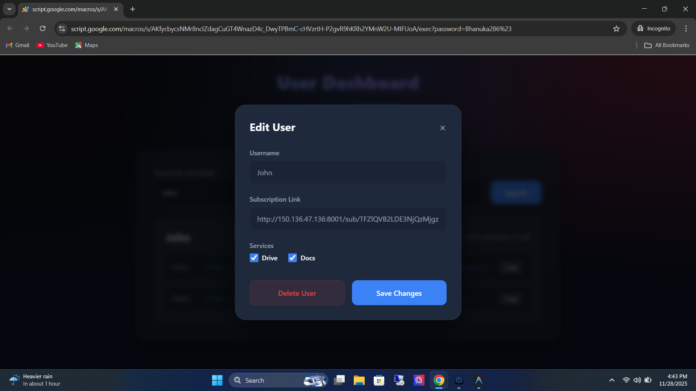

<div align="center">

# Marzban User Subscription Link Management Dashboard

[](https://developers.google.com/apps-script)
[](https://developer.mozilla.org/en-US/docs/Web/Guide/HTML/HTML5)
[](https://developer.mozilla.org/en-US/docs/Web/CSS)
[](https://developer.mozilla.org/en-US/docs/Web/JavaScript)
[](https://www.gnu.org/software/bash/)
[](https://opensource.org/license/gpl-3-0)

**A powerful, secure, and modern web dashboard for managing Marzban VPN user subscription links with seamless Google Apps Script integration.**

[Report Bug](https://github.com/yourusername/repo/issues) · [Request Feature](https://github.com/yourusername/repo/issues)

</div>

---

## 📑 Table of Contents

-   [About The Project](#-about-the-project)
-   [Key Features](#-key-features)
-   [Tech Stack](#-tech-stack)
-   [Prerequisites](#-prerequisites)
-   [Installation](#-installation)
    -   [Google Apps Script Setup](#1-google-apps-script-setup)
    -   [Marzban Server Setup](#2-marzban-server-setup)
-   [Usage](#-usage)
-   [Screenshots](#-screenshots)
-   [Contributing](#-contributing)
-   [License](#-license)

---

## 📖 About The Project

The **Marzban User Subscription Link Management Dashboard** is a custom-built solution designed to bridge the gap between your Marzban VPN panel and user distribution. It provides a sleek, password-protected interface for administrators to create, manage, and distribute VPN subscriptions.

By leveraging **Google Apps Script**, this project eliminates the need for a dedicated backend server for the dashboard, utilizing Google Drive as a secure database and file storage system.

## ✨ Key Features

*   **🔐 Secure Authentication**: Robust password protection with a modern, animated login interface.
*   **👥 User Management**:
    *   **Create**: Add users with subscription links and auto-generate Google Drive/Docs files.
    *   **Search**: Instant search functionality with one-click copy for subscription links.
    *   **Edit**: Modify user details and service allocations on the fly.
    *   **Delete**: Remove users and automatically clean up associated files from Google Drive.
*   **🔄 Webhook Integration**: Real-time synchronization with your Marzban server. Events like user creation, updates, and deletions are automatically reflected in the dashboard.
*   **🎨 Modern UI**: Built with a responsive, glassmorphism-inspired design that looks great on any device.
*   **☁️ Cloud Native**: Fully serverless architecture running on Google's infrastructure.

## 🛠 Tech Stack

*   **Frontend**: HTML5, CSS3 (Vanilla with CSS Variables), JavaScript (ES6+)
*   **Backend**: Google Apps Script (JavaScript based)
*   **Database**: Google Drive (JSON file storage)
*   **Automation**: Bash Scripting (for server configuration)

## 📋 Prerequisites

Before you begin, ensure you have the following:

*   A **Google Account** (to host the Apps Script).
*   Access to a **Marzban Server** (SSH access required).
*   Basic knowledge of deploying Web Apps on Google Apps Script.

## 🚀 Installation

### 1. Google Apps Script Setup

1.  **Create Project**: Go to [Google Apps Script](https://script.google.com/) and start a new project.
2.  **Import Files**: Create the following files in your project and copy the code from this repository:
    *   `Code.gs`
    *   `login.html`
    *   `dashboard.html`
3.  **Configure**:
    *   Open `Code.gs`.
    *   Set the `host` variable to your Marzban panel URL.
    *   Set the `password` variable to your desired dashboard password.
4.  **Deploy**:
    *   Click **Deploy** > **New deployment**.
    *   Select **Web app**.
    *   **Execute as**: `Me`.
    *   **Who has access**: `Anyone` (Crucial for Webhook functionality).
    *   Click **Deploy** and **Copy the Web App URL**.

### 2. Marzban Server Setup

1.  **Connect**: SSH into your Marzban server.
2.  **Run Script**:
   ```bash
bash <(curl -s https://raw.githubusercontent.com/praveenkarunarathne/Marzban-User-Subscription-Link-Management-Dashboard/refs/heads/main/marzban_webhook.sh)
```
4.  **Input URL**: When prompted, paste the **Web App URL** you copied earlier.

*The script will automatically configure your `.env` file to send webhooks to your new dashboard.*

## 💻 Usage

1.  Navigate to your **Web App URL**.
2.  Log in using the password you configured.
3.  **Dashboard Overview**:
    *   Use the **Create User** tab to add new clients.
    *   Use the **Search User** tab to find existing clients and copy their subscription links.
    *   Click on a username in the search results to **Edit** or **Delete** them.

## 📸 Screenshots






## 🤝 Contributing

Contributions are what make the open source community such an amazing place to learn, inspire, and create. Any contributions you make are **greatly appreciated**.

1.  Fork the Project
2.  Create your Feature Branch (`git checkout -b feature/AmazingFeature`)
3.  Commit your Changes (`git commit -m 'Add some AmazingFeature'`)
4.  Push to the Branch (`git push origin feature/AmazingFeature`)
5.  Open a Pull Request

## 📝 License

Distributed under the GNU GPLv3 License. See `LICENSE` for more information.

---

<div align="center">
    <b>Built with ❤️ for the Community</b>
</div>


